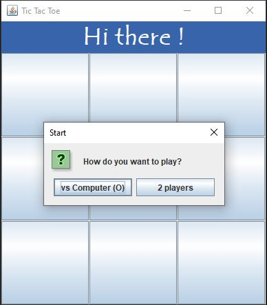

# Tic-tac-toe game
A simply tic-tac-toe game writing in Java with UI in Swing.

## Set up
Simply download the Morpion.java file and run it in your favourite IDE.

## How to play
### Rules
The aim of the game is to align our pieces horizontally, vertically or diagonally before your opponent does. Each player takes it in turns to play, one piece per turn. If one of the players aligns his pieces before the other, he is declared the winner. It may happen that the game ends without a winner, in which case there is a tie.

### Beginning
Launch the application and the following window will appear :

You have two options :
- vs Computer starts a game against the computer. The computer has the O's and you have the X's
- 2 players starts a two-player game
If you close this window, you will go straight to a 2-player game.

### vs Computer
In the case of the first option, a draw will be held to decide whether you or the computer starts the game. The game continues until a winner is declared or until there is a tie.

### Two players
If you choose the second option, a draw will be held to decide whether you or the other player starts the game. The game continues until either you or your opponent is designated the winner or there is a tie.

### End of the game
At the end of the game, a winner is decided unless there is a tie.

In both cases, you can choose to restart the game by selecting the "Restart" option or quitting the game by choosing the "Quit" option. If you close this window, the application will close.

Good game ;)
